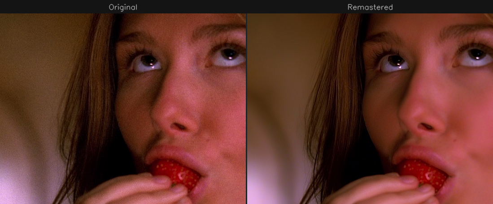
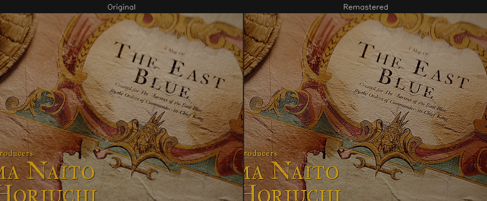
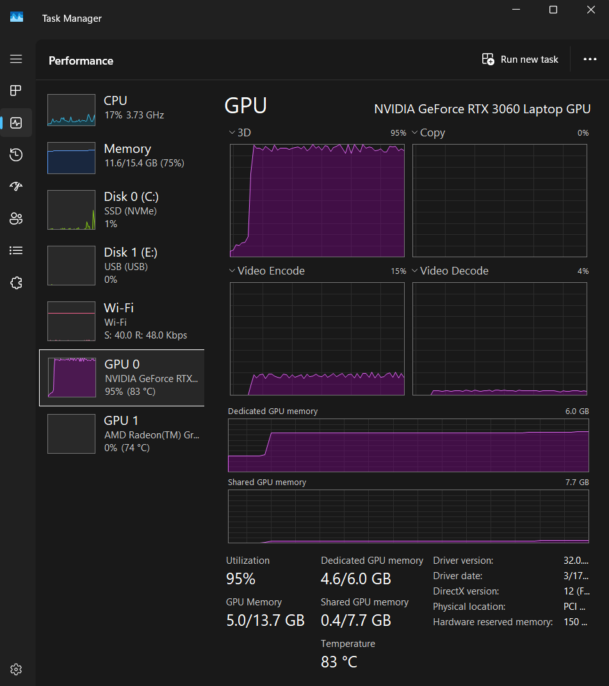

# Remaster

Remove compression artifacts and recover lost detail from any video -- faster than real-time on a laptop GPU.

> **53 fps at 1080p | 13 fps at 4K | Any resolution | 4 MB model | One command**





*Left: compressed source. Right: remastered. Samples from Firefly (2002) and One Piece (2023).*

## What It Does

Remaster enhances video quality by removing compression artifacts (banding, blocking, mosquito noise) and recovering fine detail that was lost during encoding. It works on any resolution -- 720p, 1080p, 1440p, 4K -- and outputs 10-bit HEVC with full audio and subtitle passthrough.

The model is tiny (4 MB, 1M parameters) and runs entirely on the GPU. Everything stays in video memory: hardware decode, neural network inference, hardware encode. No CPU bottlenecks, no temporary files.

| Resolution | FPS (RTX 3060 laptop) | Time for 44-min episode |
|---|---|---|
| 720p | ~100+ fps | ~10 min |
| **1080p** | **53 fps** | **~21 min** |
| 1440p | ~30 fps | ~37 min |
| **4K** | **13 fps** | **~85 min** |

Scales linearly with GPU power. A desktop RTX 4090 would be ~4x faster.



*Processing 4K HDR on an RTX 3060 laptop (6GB VRAM): 95% GPU utilization, all three hardware engines (CUDA, NVDEC, NVENC) running simultaneously, 4.6 GB used. Fits with room to spare.*

## Quick Start

Requires an NVIDIA GPU and [Docker Desktop](https://www.docker.com/products/docker-desktop/) (Windows or Linux).

```bash
# Build the image (one-time, ~5 min)
docker build -t remaster https://github.com/seantempesta/remaster.git

# Enhance a video (any resolution)
docker run --rm --gpus all \
  -v remaster-engines:/app/engines \
  -v /path/to/your/videos:/data \
  remaster /data/input.mkv /data/output.mkv
```

That's it. On first run, a TensorRT engine is optimized for your specific GPU (~2 min). This is cached automatically -- every run after that starts processing immediately.

### More examples

```bash
# Higher quality output (lower number = better, default 24)
docker run --rm --gpus all \
  -v remaster-engines:/app/engines -v ~/Videos:/data \
  remaster /data/movie.mkv /data/movie_enhanced.mkv --cq 20

# Process a whole season at once
docker run --rm --gpus all \
  -v remaster-engines:/app/engines -v ~/Videos:/data \
  remaster --batch /data/season1/ /data/season1-enhanced/

# Different quality preset (p1=fastest, p7=best, default p4)
docker run --rm --gpus all \
  -v remaster-engines:/app/engines -v ~/Videos:/data \
  remaster /data/input.mkv /data/output.mkv --cq 20 --preset p5
```

### Using docker compose

Edit the volume path in `docker-compose.yml`, then:

```bash
docker compose run remaster /data/episode.mkv /data/enhanced/episode.mkv
docker compose run remaster --batch /data/originals/ /data/enhanced/
```

### How the volumes work

- **`-v ~/Videos:/data`** -- Maps a directory on your machine to `/data` inside the container. Use this to give Remaster access to your video files. Input and output paths are relative to `/data`.
- **`-v remaster-engines:/app/engines`** -- A persistent Docker volume that caches the TensorRT engine. Include this on every run to avoid rebuilding (~2 min saved). One engine per resolution is cached automatically.

## Advanced: Bare Metal Install

For 5-10% more speed. Requires CUDA, TensorRT, and a C++ toolchain. See the [setup guide](docs/setup.md) for full build instructions.

```bash
# Download model from HuggingFace
mkdir -p checkpoints/drunet_student
wget https://huggingface.co/seantempesta/remaster-drunet/resolve/main/drunet_student.onnx \
    -O checkpoints/drunet_student/drunet_student.onnx

# Build TensorRT engine for your GPU (one-time)
trtexec --onnx=checkpoints/drunet_student/drunet_student.onnx \
    --shapes=input:1x3x1080x1920 --fp16 --useCudaGraph \
    --inputIOFormats=fp16:chw --outputIOFormats=fp16:chw \
    --saveEngine=checkpoints/drunet_student/drunet_student_1080p_fp16.engine

# Build the C++ pipeline
cd pipeline_cpp && cmake -B build -DCMAKE_BUILD_TYPE=Release && cmake --build build --config Release

# Run (55 fps on RTX 3060)
./build/remaster_pipeline -i input.mkv -o output.mkv \
    -e ../checkpoints/drunet_student/drunet_student_1080p_fp16.engine --cq 20
```

There's also a Python pipeline (24 fps, no C++ or TensorRT needed):

```bash
pip install torch torchvision --index-url https://download.pytorch.org/whl/cu130
python pipelines/remaster.py -i input.mkv -c checkpoints/drunet_student/final.pth \
    --nc-list 16,32,64,128 --nb 2 --encoder hevc_nvenc --mux-audio --compile
```

## Benchmarks

Measured on RTX 3060 Laptop GPU (6GB VRAM). All pipelines process 1080p 10-bit HEVC with audio passthrough.

| Pipeline | FPS | Notes |
|----------|-----|-------|
| **Docker** | **53** | Easiest setup. One command. |
| C++ bare metal | 55 | Maximum speed. Requires build toolchain. |
| NVEncC + VapourSynth | 39 | For VapourSynth users. |
| Python + torch.compile | 24 | No TensorRT needed. Pure Python. |

## Not AI Slop

Remaster is **not** an AI upscaler, denoiser filter, or content generator. It doesn't hallucinate detail, add fake sharpening halos, or reimagine what a frame "should" look like. It doesn't change the artistic intent of the content.

What it does:
- **Removes compression artifacts** — banding, blocking, mosquito noise, ringing
- **Recovers real detail** — fine texture and edges that were destroyed by lossy encoding
- **Preserves everything else** — colors, brightness, contrast, grain, artistic look

The model was trained on paired frames: original compressed video as input, with carefully denoised and sharpened versions as targets. It learns to undo specific compression damage, not to "enhance" or "improve" content subjectively.

Per-frame color and brightness transfer ensures the output always matches the input's visual characteristics. The model can only remove artifacts and sharpen — it cannot shift colors, change exposure, or add content that wasn't there.

## How It Works

A neural network (pure Conv+ReLU, no attention) learns to reverse compression damage by training on thousands of paired frames: original compressed video as input, high-quality denoised and sharpened frames as targets. The 4 MB model runs through NVIDIA TensorRT with CUDA graph capture for minimal launch overhead.

The full pipeline runs entirely on the GPU with zero CPU round-trips:

```
Input Video --> NVDEC (hardware decode) --> CUDA color convert
  --> Capture input color stats
  --> TensorRT inference (artifact removal + detail recovery)
  --> Transfer input color/brightness to output
  --> CUDA color convert --> NVENC (hardware encode) --> Output MKV
```

For details on the model architecture, training process, and research notes, see the [technical documentation](docs/architecture.md).

## Current Limitations

- **SDR only** — the pipeline uses BT.709 color space. HDR content (Dolby Vision, HDR10, BT.2020) will process but colors may shift. The color transfer step mitigates this but proper HDR support is planned.
- **Trained on 1080p** — the model works at any resolution (720p through 4K) but was trained on 1080p HEVC content. Quality improvements are most visible on compressed 1080p sources. High-bitrate 4K sources may show subtler improvements.
- **Dark scene brightness** — some dark scenes can shift slightly in brightness. The per-frame color transfer helps, but isn't perfect. More training data with dark scenes would improve this.
- **Residual noise** — the model removes most compression noise but some fine noise remains, particularly in flat gradients. More training pairs and GPU time would help.
- **Sharpening ceiling** — detail recovery is limited by what information survives compression. Heavily compressed sources (low bitrate streaming) benefit most; high-quality BluRay sources show less dramatic improvement.

This project was built on ~$200 of cloud GPU time. The model could get significantly better with more training data and compute. Contributions of GPU time are welcome — see the [architecture doc](docs/architecture.md) for training details.

## Documentation

| Guide | Description |
|-------|-------------|
| [Setup](docs/setup.md) | Environment, CUDA, TensorRT, C++ build instructions |
| [Deployment](docs/deployment.md) | All pipeline options, real-time playback, engine builds |
| [Architecture](docs/architecture.md) | Model design, training, distillation, research notes |
| [Model Card](docs/model-card-student.md) | Full model specifications and performance data |

## Acknowledgments

- [KAIR](https://github.com/cszn/KAIR) -- DRUNet architecture (MIT license)
- [NVIDIA Video Codec SDK](https://developer.nvidia.com/video-codec-sdk) -- NVDEC/NVENC hardware codecs
- [vs-mlrt](https://github.com/AmusementClub/vs-mlrt) -- VapourSynth TensorRT inference

## License

MIT
