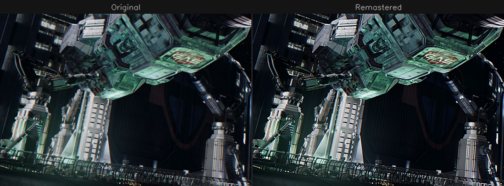

# remaster

You know that feeling when you want to rewatch an old favorite and the only copy you can find looks like it was compressed through a potato? Blocky gradients, smeared faces, fine detail replaced with MPEG sludge. Some people will tell you that's "charming" or "authentic." Those people are wrong. The director didn't spend months on lighting and color grading so you could watch a copy that looks like it was faxed.

This project uses a tiny neural network to fix it — removing compression artifacts AND recovering detail from video at native resolution, faster than real-time on a laptop GPU.

> **Status:** Production pipeline running. 1.06M parameter student model processes 1080p at **39 fps** on an RTX 3060 — encoding a 44-minute episode in under 30 minutes with audio passthrough. Full Firefly (2002) remaster in progress.




*All samples from Firefly (2002, Fox) and One Piece (2023, Netflix). Left: compressed HEVC source. Right: remastered output.*

## The Problem

Compressed video (H.264/H.265) destroys detail in ways that are obvious to the eye but hard to undo. Blocking, ringing, banding, mosquito noise — the usual suspects. Traditional denoising filters either nuke the detail along with the artifacts, or barely touch them. Neural networks can learn the difference, but the good ones are too slow for a whole TV series.

## How It Works

### Teacher-Student Distillation

A large **teacher** model (32.6M params) learns to enhance video using perceptual and pixel-level losses against high-quality targets. A tiny **student** model (1.06M params) then learns to replicate the teacher's output at 30x the speed through knowledge distillation with feature matching.

Both models are DRUNet (UNetRes) — pure Conv+ReLU residual U-Nets. No attention, no normalization layers, no dynamic operations. This makes them 100% compatible with TensorRT INT8 quantization and CUDA graph capture.

### Training Targets

[SCUNet GAN](https://github.com/cszn/SCUNet) (a transformer-based perceptual denoiser) processes thousands of source frames to generate clean targets, with Unsharp Mask applied to recover sharpness:

```
target = SCUNet_GAN(frame) + USM(1.0)
```

Early experiments used a mix of degraded inputs (raw originals, +noise, +blur) which helped the model generalize. The current best results come from training directly on the original compressed frames as input — the model learns the specific artifact patterns of real HEVC compression rather than synthetic degradations. This is still an active area of experimentation; the optimal input strategy may depend on the source material.

### Loss Functions

- **Charbonnier** — smooth L1 pixel loss for overall fidelity
- **[DISTS](https://github.com/dingkeyan93/DISTS)** — perceptual loss calibrated to human perception of compression artifacts. This is what prevents the softness that pure pixel losses produce.
- **Feature Matching** — L1 distance between student and teacher encoder features at each U-Net level, using learned 1x1 adapter convolutions

### Full-Frame Fine-Tuning

Initial training uses 256x256 random crops for efficiency. A final fine-tuning pass uses full 1920x1080 frames so the model learns how dark edges, letterboxing, and brightness transitions behave across the full frame — fixing artifacts that crop-based training misses.

## Results

| | DRUNet Teacher | DRUNet Student | SCUNet GAN |
|--|---------------|---------------|------------|
| **Parameters** | 32.6M | **1.06M** | 15.2M |
| **Quality (PSNR)** | 53.27 dB | 49.98 dB | reference |
| **Sharpness** | 107% of original | ~100% | ~95% |
| **Speed (RTX 3060)** | ~5 fps | **44 fps** | 0.5 fps |
| **VRAM** | ~2 GB | **~500 MB** | 4.8 GB |
| **Checkpoint** | 125 MB | **4 MB** | 60 MB |
| **TRT FP16** | — | 52 fps (raw) | — |
| **TRT INT8** | — | 55+ fps (raw) | — |
| **Episode (44 min)** | ~2.5 hours | **28 minutes** | ~24 hours |

## Deployment

Four encoding paths, fastest to most portable:

### C++ Zero-Copy Pipeline (44 fps, fastest)

NVDEC → TensorRT → NVENC entirely on GPU. No Python, no pipes. 10-bit HEVC MKV output with audio passthrough.

```bash
pipeline_cpp/build/remaster_pipeline.exe \
    -i input.mkv -o output.mkv \
    -e checkpoints/drunet_student/drunet_student_1080p_fp16.engine --cq 20
```

### NVEncC + VapourSynth (39 fps)

VapourSynth runs in-process with the encoder — no pipe bottleneck.

```bash
python remaster/encode_nvencc.py input.mkv output.mkv
```

### VapourSynth + ffmpeg (20 fps)

Standard pipe-based encoding. Wider compatibility.

```bash
python remaster/encode.py input.mkv output.mkv
```

### Python Streaming (24 fps)

Pure Python with torch.compile. No VapourSynth needed.

```bash
python pipelines/remaster.py -i input.mkv \
    -c checkpoints/drunet_student/final.pth \
    --nc-list 16,32,64,128 --nb 2 \
    --encoder hevc_nvenc --mux-audio --compile
```

### Real-Time Playback

Configure mpv with VapourSynth for live enhancement:

```
# mpv.conf
hwdec=auto-copy
vf=vapoursynth="C:/path/to/remaster/play.vpy"
```

### C++ Zero-Copy Pipeline (60+ fps, WIP)

NVDEC → TensorRT → NVENC entirely on GPU. No CPU round-trips, no Python.

```
pipeline_cpp/build/remaster_pipeline.exe --input video.mkv --output enhanced.mkv \
    --engine checkpoints/drunet_student/drunet_student_1080p_fp16.engine
```

## Setup

### Prerequisites

- Python 3.10+, PyTorch 2.11+ with CUDA 12.6
- NVIDIA GPU (6GB+ VRAM for inference)
- [Modal](https://modal.com) account for cloud training (optional)

### Install

```bash
conda create -n upscale python=3.10
conda activate upscale
pip install torch torchvision --index-url https://download.pytorch.org/whl/cu126
pip install opencv-python-headless numpy matplotlib av timm
git submodule update --init --recursive
```

### First Run

```bash
# Export student model to ONNX
python tools/export_onnx.py

# Build TensorRT engine (one-time, ~2 min)
tools/vs/vs-plugins/vsmlrt-cuda/trtexec.exe \
    --onnx=checkpoints/drunet_student/drunet_student.onnx \
    --shapes=input:1x3x1080x1920 --fp16 --useCudaGraph \
    --saveEngine=checkpoints/drunet_student/drunet_student_1080p_fp16.engine

# Encode a video
python remaster/encode_nvencc.py input.mkv output.mkv
```

### Train (Cloud)

```bash
# Teacher (quality model)
modal run cloud/modal_train.py --arch drunet --nc-list 64,128,256,512 --nb 4 \
    --checkpoint-dir checkpoints/drunet_teacher \
    --optimizer prodigy --perceptual-weight 0.05 --batch-size 64 \
    --ema --wandb --resume

# Student (distillation from teacher)
modal run cloud/modal_train.py --arch drunet --nc-list 16,32,64,128 --nb 2 \
    --teacher checkpoints/drunet_teacher/final.pth --teacher-model drunet \
    --checkpoint-dir checkpoints/drunet_student \
    --feature-matching-weight 0.1 --optimizer prodigy --batch-size 192 \
    --ema --wandb --resume

# Full-frame fine-tune (fixes edge artifacts)
modal run cloud/modal_train.py --arch drunet --nc-list 16,32,64,128 --nb 2 \
    --teacher checkpoints/drunet_teacher/final.pth --teacher-model drunet \
    --checkpoint-dir checkpoints/drunet_student \
    --feature-matching-weight 0.1 --perceptual-weight 0.05 --optimizer prodigy \
    --batch-size 4 --crop-size 0 --max-iters 5000 \
    --ema --wandb --resume --fresh-optimizer
```

## Project Structure

```
remaster/        Production encoding pipeline (VapourSynth + TRT + NVEncC)
pipelines/       Python streaming pipeline (PyAV + torch.compile + NVENC)
pipeline_cpp/    C++ zero-copy pipeline (NVDEC + TRT + NVENC, WIP)
training/        Unified training: distillation, losses, dataset, visualization
cloud/           Modal cloud training wrapper
tools/           ONNX export, INT8 calibration, data extraction, analysis
lib/             Shared code: model architectures, paths, ffmpeg utils
checkpoints/     Model weights (teacher + student)
reference-code/  Git submodules (SCUNet, KAIR, DISTS, DINOv3, NVEnc, vs-mlrt, etc.)
docs/            Research notes, plans, architecture docs
```

## Research & Exploration

### What we tried

- **RAFT optical flow temporal alignment** — Warping neighboring frames and averaging. Best result: 1.33x SNR improvement (vs teacher's 2.14x). Alignment fails at object boundaries where detail matters most.
- **DINOv3 feature matching** — Self-supervised features are noise-invariant and remarkably stable across frames (0.989 cosine similarity). Semantic patch matching outperformed RAFT for cross-frame averaging, but still couldn't beat a learned single-frame denoiser.
- **SAM 3 segmentation** — Explored for content-aware processing but segmentation models understand objects, not noise. More promising as a conditioning signal than a direct tool.
- **FFT temporal fusion** — Averaging frequency magnitudes across aligned frames. Competitive with spatial median but still below learned approaches.

So far, **learned single-frame denoisers beat multi-frame temporal approaches** for this content. But the temporal approaches were naive averaging — there's likely more to be found here.

### What we want to explore next

- **Multi-frame input with semantic embeddings** — The student model has only 1.06M parameters and sees one frame at a time. If we feed it the current frame plus cached DINOv3 or SAM embeddings from neighboring frames (say +/- 4 frames), the model could leverage temporal information without the cost of running multiple frames through the full network. The embeddings are compact (384-dim per 16x16 patch) and stable across frames, so caching them adds minimal overhead. This could dramatically improve quality, especially for noise reduction where multiple observations of the same content are mathematically optimal.

- **Content-adaptive processing via embeddings** — SAM3/DINOv3 features encode *what's in the scene* (face, fabric, background, text). If these embeddings are fed as additional input channels, the network could learn content-specific enhancement strategies — gentler on faces to preserve skin texture, more aggressive on flat walls where everything is noise, careful at object boundaries. The key insight is that the network learns the mapping, not us — we just give it the semantic context and let it figure out what to do.

- **Larger student with attention** — The 1.06M param Conv+ReLU student is impressively good but fundamentally limited. A model with even lightweight attention at the bottleneck could capture longer-range dependencies. The constraint is TensorRT INT8 compatibility and real-time speed — but with the C++ zero-copy pipeline, there's headroom for a 5-10M param model that still hits 30+ fps.

- **Temporal consistency** — Current frame-by-frame processing can produce subtle flickering. Cross-frame FFT attention or temporal loss functions during training could enforce consistency without slowing inference.

## Acknowledgments

Built on excellent open-source work:

- [KAIR](https://github.com/cszn/KAIR) — DRUNet/UNetRes architecture (MIT license)
- [SCUNet](https://github.com/cszn/SCUNet) — Training target generation
- [DISTS](https://github.com/dingkeyan93/DISTS) — Perceptual loss function
- [vs-mlrt](https://github.com/AmusementClub/vs-mlrt) — VapourSynth TensorRT inference
- [NVEnc](https://github.com/rigaya/NVEnc) — NVEncC hardware encoder with VapourSynth support
- [NVIDIA Video Codec SDK](https://developer.nvidia.com/video-codec-sdk) — NVDEC/NVENC APIs

## License

MIT
