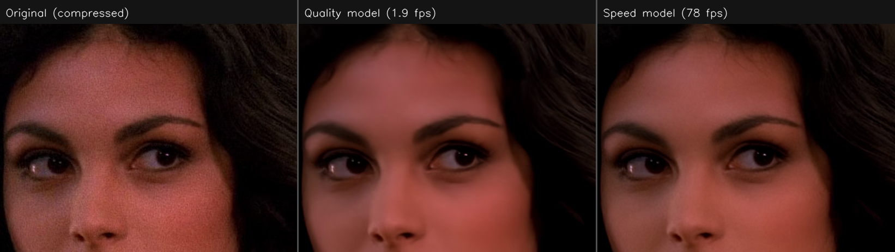
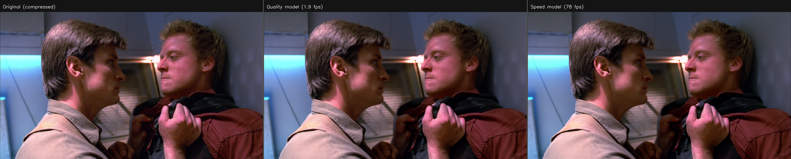
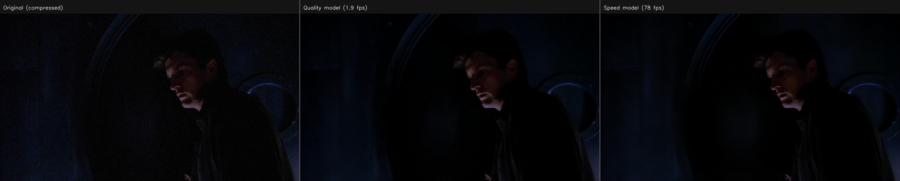
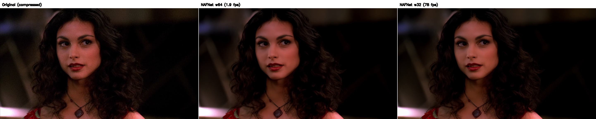

# remaster

You know that feeling when you want to rewatch an old favorite and the only copy you can find looks like it was compressed through a potato? Blocky gradients, smeared faces, fine detail replaced with MPEG sludge. Some people will tell you that's "charming" or "authentic." Those people are wrong. The director didn't spend months on lighting and color grading so you could watch a copy that looks like it was faxed. Don't settle for it.

This project uses ML to fix it — removing compression artifacts from video at native resolution, fast enough to actually use on your library.

> **Status: Active development.** The student model now runs at **78 fps** (1080p, RTX 3060) — **78x faster** than the teacher — using only 2.3 GB VRAM. Currently building a zero-copy GPU pipeline and training with DISTS perceptual loss.


*Morena Baccarin deserves better than MPEG artifacts.*


*Skin detail and lighting. The compressed original has visible banding and smearing — both models clean it up, the speed model at **78 fps**.*


*Dark scenes are the hardest — compression loves to destroy shadow detail. Both models recover it without introducing noise.*


*All comparisons from Firefly (2002, Fox). Left: compressed source. Middle: quality model (1.9 fps). Right: speed model (78 fps).*

## The Problem

Compressed video (H.264/H.265) destroys detail in ways that are obvious to the eye but hard to undo. Blocking, ringing, banding, mosquito noise — the usual suspects. Traditional denoising filters either nuke the detail along with the artifacts, or barely touch them. Neural networks can learn the difference, but the good ones are *way* too slow for a whole TV series.

## How It Works

### 1. Generate Training Targets

The best neural denoiser we found is [SCUNet](https://github.com/cszn/SCUNet) — a transformer-based model that produces excellent results but crawls at 0.5 fps. Way too slow for a whole series, but perfect as a teacher.

We run SCUNet's GAN variant over thousands of frames to generate clean targets, then blend back high-frequency detail from the originals:

```python
target = SCUNet_GAN(frame) + 0.15 * high_pass(frame)
```

This **detail transfer** is the secret sauce. The GAN cleans up compression artifacts beautifully but can lose fine texture in the process — hair, fabric weave, film grain. By extracting the high-frequency component of the original (a Gaussian high-pass filter) and blending just 15% of it back, we get targets that are both clean *and* detailed. Zero hallucination — every bit of recovered detail comes from the original source.

### 2. Distill Into a Fast Model

[NAFNet](https://github.com/megvii-research/NAFNet) is a pure CNN — no attention, no transformers, just convolutions. That makes it `torch.compile` friendly and stupidly fast. We eviscerated the middle section (12 blocks down to 4) and halved the channel width (64 to 32), producing a model that's 4.7x smaller and runs at **78 fps on a laptop GPU**.

The student learns to match the teacher's output using three complementary loss signals:

- **Charbonnier** (pixel loss) — smooth L1 for overall fidelity
- **[DISTS](https://github.com/dingkeyan93/DISTS)** (perceptual loss) — Deep Image Structure and Texture Similarity, specifically designed for assessing compression artifacts. Better calibrated to human perception than VGG feature matching, and faster too (VGG16 vs VGG19 backbone)
- **Focal Frequency Loss** — operates in the frequency domain to preserve the high-frequency detail that pixel and perceptual losses tend to smooth away

### 3. Run It

The compiled model processes 1080p video at 78 fps with `torch.compile` on a consumer RTX 3060. A 42-minute episode that took 32 hours with the teacher now takes about 14 minutes.

## Results

| Metric | NAFNet w64 | NAFNet w32-mid4 | SCUNet (teacher) |
|--------|-----------|----------------|-----------------|
| Parameters | 67M | **14.3M** | 15.2M (transformer) |
| Model inference | 1.94 fps | **78 fps** | 0.52 fps |
| End-to-end pipeline | 1.94 fps | **5.2 fps** | 0.52 fps |
| VRAM (fp16 + compile) | 3.3 GB | **2.3 GB** | 4.8 GB |
| Checkpoint size | 464 MB | **55 MB** | 60 MB |
| Quality (PSNR vs teacher) | 56.82 dB | 49.50 dB | reference |
| Speedup vs teacher | 3.7x | **78x** (raw), **10x** (pipeline) | 1x |
| Cloud speed (H100) | 27.9 fps | est. 200+ fps | ~5 fps |
| Training cost | ~$15 | **~$13** | — |

The w32-mid4 model (width=32, 4 middle blocks instead of 12) is 4.7x smaller and 40x faster than the original student while maintaining strong visual quality. The raw model throughput of 78 fps is bottlenecked by video decode/encode in the current pipeline — a [zero-copy GPU pipeline](#zero-copy-gpu-pipeline) using NVDEC/NVENC is in progress to close this gap.

> **Why is end-to-end slower than raw inference?** The model finishes a frame in 13ms, but HEVC decoding + encoding add ~170ms overhead per frame. Pipelining decode/infer/encode concurrently on separate hardware (NVDEC/CUDA/NVENC) should approach the raw 78 fps.

## Architecture

```
Local (Windows, RTX 3060 6GB)     Cloud (Modal, H100 80GB)
├── Inference pipelines            ├── Training (distillation)
├── TensorRT export/run            ├── Pair generation (SCUNet teacher)
├── Benchmarking                   └── Cloud inference pipeline
└── Quality evaluation
```

- **Local inference** — PyTorch with torch.compile, or TensorRT FP16. Zero-copy GPU pipeline via [PyNvVideoCodec](https://github.com/NVIDIA/VideoProcessingFramework) (NVDEC → inference → NVENC, WIP)
- **Cloud training** — [Modal](https://modal.com) for on-demand H100 GPU time (~$4/hr). RAM-cached datasets, CUDA event profiling, graceful shutdown via Modal Dict signals
- **Streaming pipeline** — reads video, processes frames, writes video (no intermediate files). Supports HEVC NVENC encoding with ffmpeg 7.1

## Project Structure

```
lib/           Shared code: NAFNet architecture, paths, ffmpeg utils, metrics
training/      Distillation training: losses, dataset, visualization, training loop
cloud/         Modal scripts for remote GPU training and inference
pipelines/     Production streaming denoisers (SCUNet, NAFNet, episode)
bench/         Benchmarking, quality comparison, checkpoint evaluation
tools/         Utilities: clip extraction, probing, training control
docs/          Research notes, setup guide, approach comparison
reference-code/ Git submodules: SCUNet, NAFNet, DISTS, RAFT, etc.
```

### Key Scripts

| Script | Purpose |
|--------|---------|
| `training/train_nafnet.py` | Distillation training with configurable architecture, profiling, graceful stop |
| `training/losses.py` | All loss functions: Charbonnier, DISTS, Focal Frequency |
| `cloud/modal_train.py` | Modal wrapper — upload data, train on H100, download checkpoints |
| `pipelines/denoise_nafnet.py` | NAFNet inference pipeline (configurable arch, torch.compile, NVENC) |
| `pipelines/denoise_gpu.py` | Zero-copy GPU pipeline (PyNvVideoCodec NVDEC/NVENC) |
| `tools/stop_training.py` | Graceful stop for Modal training runs |
| `bench/compare.py` | PSNR/SSIM metrics and side-by-side comparison |

## Quick Start

### Prerequisites

- Python 3.10, PyTorch 2.11+ with CUDA
- NVIDIA GPU (6GB+ VRAM for inference, training runs on cloud)
- [Modal](https://modal.com) account for cloud training (optional)

### Setup

```bash
# Create conda environment
conda create -n upscale python=3.10
conda activate upscale

# Install PyTorch with CUDA
pip install torch torchvision --index-url https://download.pytorch.org/whl/cu126

# Install other dependencies
pip install opencv-python-headless numpy matplotlib

# Initialize submodules
git submodule update --init --recursive
```

### Run Inference (Local)

```bash
# Denoise a video with NAFNet
python pipelines/denoise_nafnet.py --input video.mp4 --checkpoint checkpoints/nafnet_best.pth
```

### Train (Cloud)

```bash
# Generate training pairs (SCUNet teacher output)
modal run cloud/modal_generate_pairs.py --input-dir data/clips

# Train NAFNet student with DISTS + FFT loss
modal run cloud/modal_train.py \
    --width 32 --middle-blk-num 4 \
    --perceptual-weight 0.1 --fft-weight 500 \
    --max-iters 25000
```

## Training Visualization

The training loop generates at each validation step:
- **Sample comparison images** (input | teacher target | model prediction)
- **Loss curve charts** (pixel, perceptual, FFT, total loss + validation PSNR)
- **JSON training log** for custom analysis

## Zero-Copy GPU Pipeline

The current pipeline bounces frames through CPU memory. A zero-copy path keeps everything on the GPU:

```
NVDEC (hw decode) ──> CUDA tensor ──> NAFNet (inference) ──> CUDA tensor ──> NVENC (hw encode)
                  zero-copy                              zero-copy
```

Using [PyNvVideoCodec](https://github.com/NVIDIA/VideoProcessingFramework) (NVIDIA's official Python bindings for Video Codec SDK), `torch.from_dlpack()` provides zero-copy interop between the decoder and PyTorch. The encoder accepts GPU buffers directly. All three stages (NVDEC, CUDA cores, NVENC) are separate hardware on the GPU and can run concurrently.

**Current status:** Working end-to-end but not yet pipelined — decode/infer/encode run sequentially. Pipelining should approach the raw 78 fps throughput.

## What's Next

- **Pipeline the GPU path** — concurrent decode/infer/encode to approach 78 fps
- **Real-time playback** — mpv + VapourSynth + vs-mlrt for live enhancement during playback
- **TensorRT engine** — export w32-mid4 for ~1.5 GB VRAM, potentially faster than torch.compile
- **Batch processing** — overnight processing of entire TV libraries at 78 fps
- **Training experiments** — DISTS perceptual loss, lower detail transfer alpha, temporal consistency

## Reference Code

This project builds on several excellent open-source implementations:

- [SCUNet](https://github.com/cszn/SCUNet) — Swin-Conv-UNet denoiser (teacher model)
- [NAFNet](https://github.com/megvii-research/NAFNet) — Nonlinear Activation Free Network (student architecture)
- [DISTS](https://github.com/dingkeyan93/DISTS) — Deep Image Structure and Texture Similarity (perceptual loss)
- [RAFT](https://github.com/princeton-vl/RAFT) — Optical flow estimation

## License

MIT
